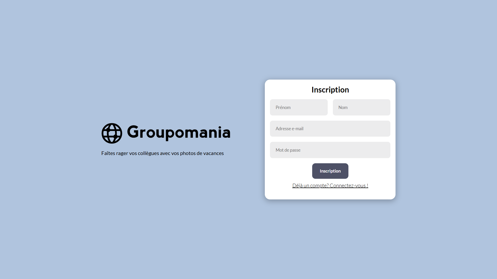

<div align="center">  
  <a href="https://groupomania-vm.vercel.app/signup" target="_blank">  
      
  </a>
  </br></br>  
  <h3 align="center">📱 Groupomania - Projet Scolaire</h3>  
</div>

## <br /> 📌 Sommaire

&nbsp;&nbsp;&nbsp; 🎨 &nbsp; [**Introduction**](#introduction)<br />
&nbsp;&nbsp;&nbsp; 🛠️ &nbsp; [**Technologies**](#technologies)<br />
&nbsp;&nbsp;&nbsp; 🎯 &nbsp; [**Fonctionnalités**](#fonctionnalités)<br />
&nbsp;&nbsp;&nbsp; 🚧 &nbsp; [**Mise à Jour**](#upgrade)<br />
&nbsp;&nbsp;&nbsp; 🚀 &nbsp; [**Installation**](#installation)

## <br /> <a name="introduction">🎨 Introduction</a>

Groupomania est un réseau social d’entreprise complet développé en stack **MERN** (**MongoDB**, **Express**, **React**, **Node.js**).

Les employés peuvent publier du contenu texte ou image, liker des posts, et interagir dans un fil d’actualité sécurisé et responsive.

L’authentification est sécurisée par **JWT**, la gestion d’images est assurée localement en développement, ou via **Cloudinary** en production.

> 📂 Pour plus de détails, consultez le [dossier](.docs/).

## <br /> <a name="technologies">🛠️ Technologies</a>

### Backend

- Node.js, Express, MongoDB (Mongoose)
- Authentification JWT (jsonwebtoken + bcrypt)
- Upload d’images : Multer (local) ou Cloudinary (prod)
- Sécurité : Helmet, CORS, password-validator, validator

### Frontend

- React, React Router, Context API
- Formulaires avec feedback utilisateur
- Responsive Design

### Déploiement

- API : [**Render**](https://groupomania-social-api.onrender.com)
- UI : [**Vercel**](https://groupomania-vm.vercel.app)
- Media : [**Cloudinary**](https://console.cloudinary.com/)

## <br /> <a name="fonctionnalités">🎯 Fonctionnalités</a>

- Authentification (JWT) : Inscription, Connexion, Session persistante
- Création, modification et suppression de posts
- Upload d’images avec prévisualisation dynamique
- Système de likes unique par utilisateur
- Nettoyage automatique des images supprimés sur Cloudinary ou en local
- Rôle administrateur : modération des publications
- Détection environnement : development ou production
- Feedback utilisateur clair : email invalide, mdp faible, etc...

## <br /> <a name="upgrade">🚧 Mise à Jour</a>

- Gestion intelligente des images (Cloudinary ou stockage local)
- Refonte UI/UX : affichage des erreurs, preview image, accessibilité
- Refactor : structure `api/` (backend) et `client/` (frontend)
- Déploiement performant via [**Render**](https://groupomania-social-api.onrender.com) (API) & [**Vercel**](https://groupomania-vm.vercel.app) (UI)

## <br /> <a name="installation">🚀 Installation</a>

### ✅ Prérequis

- [Git](https://git-scm.com/) &nbsp;—&nbsp; Système de gestion de versions
- [Node.js](https://nodejs.org/fr) &nbsp;—&nbsp; Exécuteur local de scripts JavaScript
- [npm](https://www.npmjs.com/) &nbsp;—&nbsp; Gestionnaire de paquets JavaScript
- [MongoDB](https://www.mongodb.com/) — Base de données NoSQL
- [Google Chrome](https://www.google.com/) &nbsp;—&nbsp; Navigateur moderne
- [Visual Studio Code](https://code.visualstudio.com/) &nbsp;—&nbsp; Éditeur de code
- [Render](https://render.com/) &nbsp;—&nbsp; Déploiement de l’API en production
- [Cloudinary](https://cloudinary.com/) &nbsp;—&nbsp; Hébergement et optimisation des images
- [Vercel](https://vercel.com/home) &nbsp;—&nbsp; Déploiement du frontend en production

### 📥 Cloner le projet

```bash
git clone https://github.com/ValentinMadiot/groupomania-social_api
cd groupomania-social_api
```

### 📝 Configuration de l'environnement

#### 1. DEVELOPPEMENT (Local)

Renommer `.env.exemple` en `.env` dans `./api`

Ajoutez les variables d’environnement dans le fichier `.env` :

```bash
# PORT
PORT=8080

# IDENTIFIANT BASE DE DONNEES (MongoDB)
MONGODB_URI_DEV=mongodb://localhost:27017/groupomania

# PASSWORD JWT (JSON Web Token)
JWT_TOKEN=secret_token
JWT_TIME=24h
```

Renommer `.env.exemple` en `.env` dans `./client`

Ajoutez les variables d’environnement dans le fichier `.env` :

```bash
# API ENDPOINT
REACT_APP_API_URL=http://localhost:8080

# PUBLIC IMAGES PATH
REACT_APP_PUBLIC_FOLDER=http://localhost:8080/public/images/
```

#### 2.1 PRODUCTION (Render)

Ajoutez les variables d’environnement sur Render :

```bash
# PORT
PORT=8080

# IDENTIFIANT BASE DE DONNEES (MongoDB)
MONGODB_URI_PROD=mongodb+srv://<username>:<password>@cluster0.mongodb.net/myDatabase...

# PASSWORD JWT (JSON Web Token)
JWT_TOKEN=secret_token
JWT_TIME=24h

# IDENTIFIANT CLOUDINARY
CLOUD_API_KEY=clef_api
CLOUD_API_SECRET=api_secrete
CLOUD_NAME=nom_du_stockage
```

#### 2.2 FRONTEND (Vercel)

Ajoutez les variables d’environnement sur Vercel :

```bash
# URL RENDER
REACT_APP_API_URL=https://nom_projet.onrender.com
```

### ▶️ Lancer le projet

#### Backend

```bash
cd api
npm install
npm start
```

Backend disponible sur : `http://localhost:8080`

#### Frontend

```bash
cd client
npm install
npm start
```

Frontend disponible sur : `http://localhost:3000`
